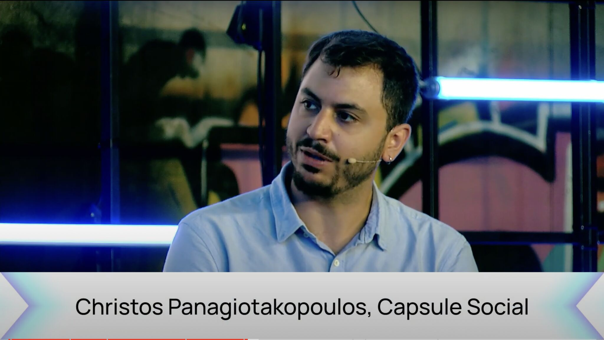
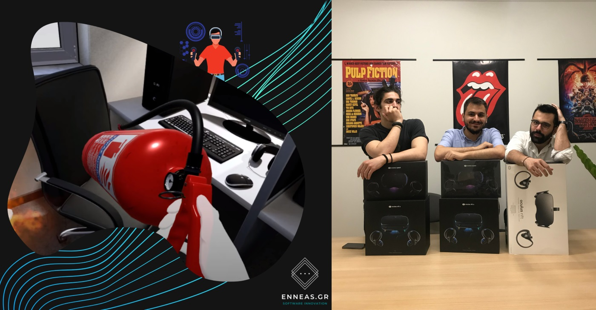
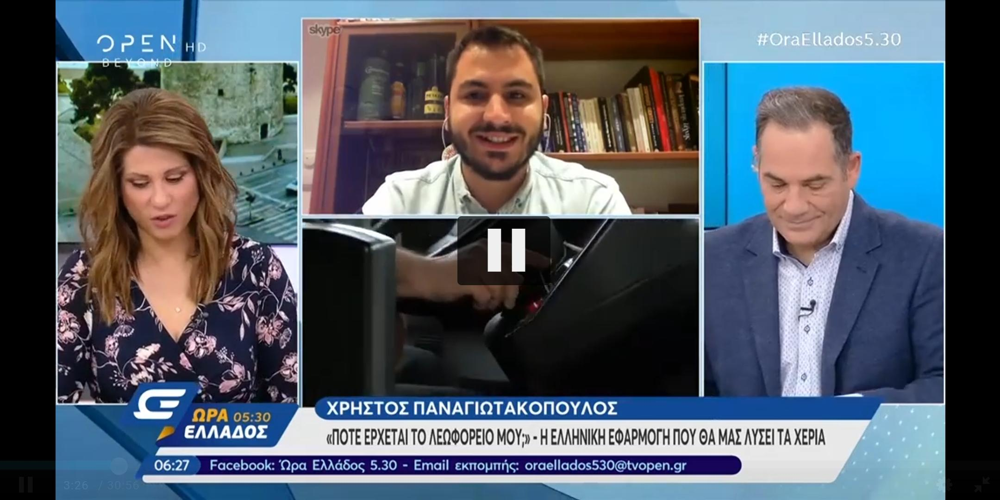

# Me on the web

Various places I have appeared on the web and beyond!

## Media coverage

### NEARCON 2022 @ Lisbon, Portugal - Representing [Capsule Social](https://capsule.social)

1. [Not Your Parent's Facebook: Building Social Media in Web3](https://www.youtube.com/watch?v=C-qg7eRlLtE&t=5801s)

    Together with fellow industry experts, we participated in a panel discussion where we discussed about the next generation of social media built on decentralised technologies and how we apply these on Blogchain.

    

2. [Ready Layer One: Blogchain decentralized blogging platform built on NEAR for web3 | podcast](https://podcasts.apple.com/us/podcast/blogchain-decentralized-blogging-platform-built-on/id1607956235?i=1000583154222)
    
    Together with my colleague Jack Dishman we had the opportunity to discuss Blogchain and show how decentralisation can solve the issues found at traditional social media.

    

### ENNEAS

1. [Μια Ελληνική εταιρεία που παίζει δυνατά στο VR/AR και τα chatbots](https://www.itspossible.gr/enneas-syn/)
    
    Joint interview with my ex-colleague George Patseas, on how we created a sustainable software agency business in Athens, Greece.

    

### "When is my bus coming" chatbot coverage (in Greek)

1. [«Πότε έρχεται το λεωφορείο;»: 22χρονος έφτιαξε εφαρμογή που θα λατρέψετε (iEfimerida.gr)](https://www.iefimerida.gr/ellada/pote-erhetai-leoforeio-22hronos-eftiaxe-efarmogi)

    Interview on the greek news site iEfimerida.gr for my Facebook Chatbot "When is my bus coming".
2. [Χρήστος Παναγιωτακόπουλος, ο νότιος που έφτιαξε το “Πότε έρχεται το λεωφορείο;” (noupou.gr)](https://www.nou-pou.gr/stories/christos-panagiotakopoulos-i-efarmogi-ine-ena-pleonektima-sto-viografiko-mou/)

    Interview on the local news site noupou.gr for my Facebook Chatbot "When is my bus coming".
3. [«Πότε έρχεται το λεωφορείο μου»: Ο 22χρονος που έβαλε τέλος στο μαρτύριο αναμονής μας στις στάσεις (flash.gr)](https://www.flash.gr/tech/1542911/pote-erchetai-to-lewforeio-moy-o-22chronos-poy-ebale-telos-sto-martyrio-anamonis-mas-stis-staseis)

    Interview on the greek news site flash.gr for my Facebook Chatbot "When is my bus coming".
4. [Εφαρμογή για δρομολόγια λεωφορείων στέλνει στους επιβάτες καρδούλες και ερωτόλογα!](https://newpost.gr/ellada/efarmogh-gia-dromologia-lewforeiwn-stelnei-stoys-epibates-kardoyles-kai-erwtologa/)
    
    Article on the greek news site newspost.gr for my Facebook Chatbot "When is my bus coming".
5. [Η ελληνική εφαρμογή που μας λύνει τα χέρια - Ώρα Ελλάδος 5.30 15/4/2019 | OPEN TV](https://www.youtube.com/watch?v=Lp12GuCJ2dU)
    
    TV interview on the greek nationwide TV channel "Open Beyond" for my Facebook Chatbot "When is my bus coming".

## Various Profiles

1. [Rembetiko Forum](https://rembetiko.gr/u/chrispanag/summary)
2. [youtube.com](https://youtube.com/@chrispanag)