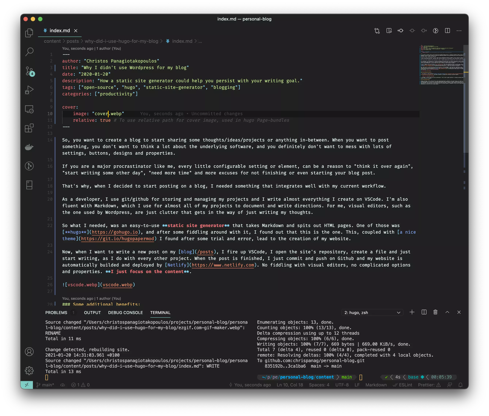
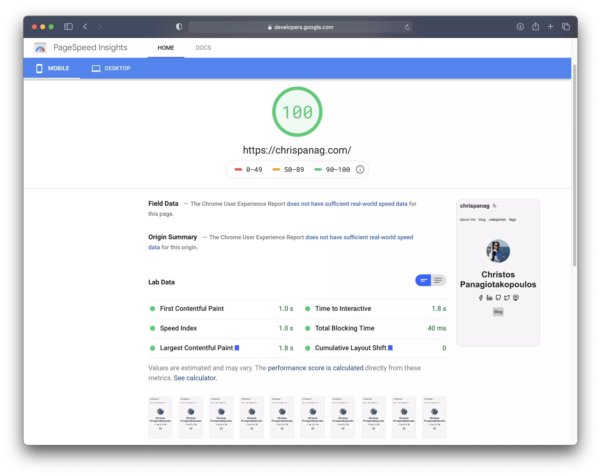

You want to create a blog to start sharing some thoughts, ideas or projects. But when you want to post something, you don't want to think a lot about the underlying software, and you definitely don't want to mess with lots of settings, buttons, designs and properties.

If you are a major procrastinator like me, every little configurable setting or element, can be a reason to "think it over again", "start writing some other day", "need more time" and more excuses for not finishing or even starting your blog post.

That's why, when I decided to start posting on a blog, I needed something that integrates well with my current workflow.

As a developer, I use git/github for storing and managing my projects and I write almost everything I create on VSCode. I'm also fluent with Markdown, which I use for most of my projects to document and write directions. For me, visual editors, such as the one used by Wordpress, are just clutter that gets in the way of writing my thoughts.

So what I needed, was an easy-to-use **static site generator** that takes Markdown and spits out HTML pages. One of those was [**hugo**](https://gohugo.io), and after some fiddling around with it, I found out that this is the one. This, coupled with [a nice theme](https://git.io/hugopapermod) lead to the creation of my website.

Now, when I want to write a new post on my [blog](/posts), I fire up VSCode, open the [site's repository](https://github.com/chrispanag/personal-blog), create a file and just start writing, as I do with every other project. When the post is finished, I just commit and push on Github and my website is automatically builded and deployed by [Netlify](https://www.netlify.com). No fiddling with visual editors, no complicated options and properties. **I just focus on the content**.

### Some additional benefits

1. The website is ranked 100/100 on [Google's Page Speed Insights](https://developers.google.com/speed/pagespeed/insights/?url=https%3A%2F%2Fchrispanag.com). This means my website is treated more favorably from search engines.

   

2. No upkeep - security checks and server maintainance. I don't need to update anything, or configure anything other than what matters the most, my website.

## Conclusion/Disclaimer

Having said these, I don't object that for some people/organizations, wordpress is the right choice. As a matter of fact, I have suggested wordpress for many clients, especially organizations that need the extra features, extensibility and customizations. But for a developer, like me, who just wants to blog and share his views and ideas, I believe a static website is the best way to go. More importantly it's the best way to persist writing, because it integrates so well with a developer's day-to-day workflow, reducing the friction to create content.
